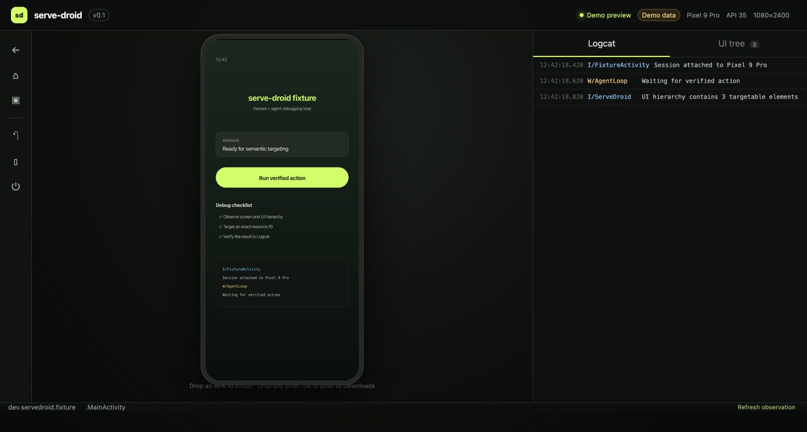

# serve-droid

**A shared browser cockpit and agent control plane for Android.** Stream an emulator or physical
device, control it from Chrome or Edge, inspect its semantic UI tree and Logcat, or hand the same
session to an MCP-compatible coding agent.

> Status: v0.1 development release. The public API is versioned, but video transport and device
> compatibility still need validation on the published support matrix.



_Browser cockpit with deterministic demo data. This image is not presented as real-device
validation; hardware evidence is tracked separately in the release checklist._

## Why

Android Studio mirrors devices, scrcpy provides excellent native display/control, and Maestro is a
strong test automation system. serve-droid focuses on a different loop: a human and an AI agent
sharing one observable browser session during development and debugging.

## Requirements

- Node.js 22 or newer
- [Android SDK Platform Tools](https://developer.android.com/tools/releases/platform-tools) with
  `adb` on `PATH`, `ANDROID_HOME`, or `ANDROID_SDK_ROOT`
- An Android 8 / API 26+ emulator or device visible in `adb devices -l`
- Current Chrome or Edge for the browser cockpit

Android Platform Tools are never downloaded silently or redistributed.

## Quick start

```bash
npx serve-droid doctor
npx serve-droid start --detach
npx serve-droid list --json
```

Open the printed local URL. The server listens on `127.0.0.1`, generates a random token, and injects
it into the local UI. To select a device:

```bash
npx serve-droid --device emulator-5554
```

Coordinates are normalized: `(0, 0)` is the logical top-left and `(1, 1)` is the bottom-right.

```bash
npx serve-droid tap 0.5 0.5
npx serve-droid swipe 0.5 0.8 0.5 0.2 --duration 350
npx serve-droid app deep-link 'servedroid://fixture/example'
```

## MCP

```json
{
  "mcpServers": {
    "serve-droid": {
      "command": "npx",
      "args": ["-y", "serve-droid", "mcp"]
    }
  }
}
```

The MCP surface deliberately provides explicit bounded tools instead of arbitrary shell access. See
[the MCP guide](docs/mcp.md).

## Security

- Loopback-only binding by default.
- Bearer authentication for reads, mutations, video, and control.
- Browser WebSockets carry credentials in a subprotocol header, not a URL.
- No arbitrary ADB or host shell endpoint.
- Uploads are capped at 256 MiB, written to a private temporary directory, and removed immediately.
- `clear` and `uninstall` require explicit confirmation from non-interactive clients.

Read [SECURITY.md](SECURITY.md) before binding to a LAN interface.

## Supported and deferred

v0.1 targets macOS, Linux, Windows, Android API 26+, local emulators, USB devices, Wi-Fi ADB,
Chrome, and Edge. Safari, Firefox, audio, cloud device labs, tunnels, accounts, multi-user roles,
recording, AVD provisioning, iOS, and arbitrary shell access are deferred.

## Development

```bash
pnpm install
pnpm verify
pnpm --filter @serve-droid/cli dev -- doctor
```

The Android fixture source is under `fixtures/android-test-app`. Real-device tests run only when
`SERVE_DROID_DEVICE_TEST=1` is set.

See the evidence-based [release checklist](docs/TODO.md) for completed work and the remaining
hardware, platform, and publication gates.

## Project TODO

- [x] Publish the open repository with protected `main`, CodeQL, Dependabot, and secret scanning.
- [x] Ship the shared CLI, HTTP/WebSocket, MCP, Agent Skill, and browser cockpit foundation.
- [x] Add a reproducible, clearly labeled cockpit screenshot to this README.
- [ ] Complete the real-device acceptance matrix on macOS, Linux, and Windows.
- [ ] Publish and validate the npm release candidate before tagging v0.1.0.

The complete, evidence-based checklist lives in [docs/TODO.md](docs/TODO.md). Items stay unchecked
until the repository contains the implementation or the required external evidence.

## License

Apache-2.0. See [THIRD_PARTY_NOTICES.md](THIRD_PARTY_NOTICES.md).
